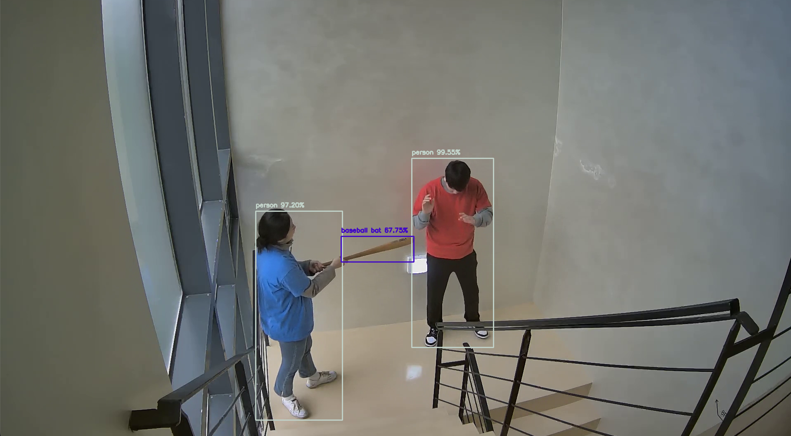
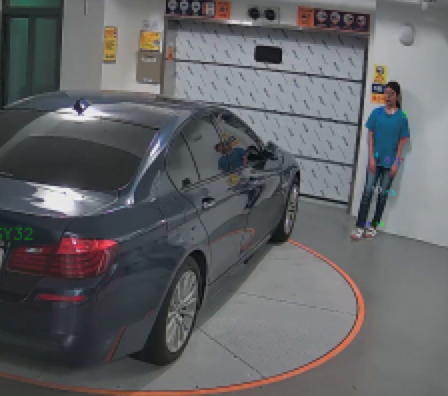
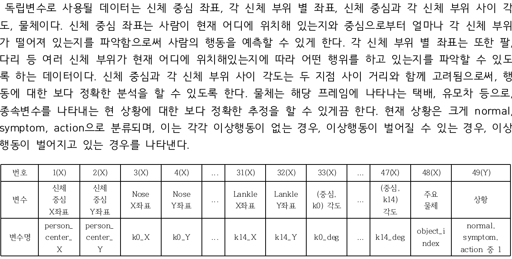

# CCTV-anomaly-detect
2022 1학기 컴퓨터공학전공 개별연구
<h2>2022 여름학기 컴퓨터공학전공 개별연구  [딥러닝을 이용한 CCTV 영상에서의 이상행위자 분석 및 예측 기법 연구]</h2>

<h2>개요</h2>

공공의 안전을 위해 CCTV의 역할은 점점 더 중요해지고 있다. 대한민국 내 208개의 지자체에서 CCTV 통합관제센터를 구축하고 있고, 이는 사람에 의해 운용되고 있다. 이상행위 발생에 대한 즉각적인 조치와 집중 모니터링을 할 수 있도록 지능형 CCTV를 도입할 필요성이 제기되고 있으며, 더 나아가 이상행위 발생을 예측하여 사전 예방할 수 있는 기술의 필요성 또한 높아지고 있다. CCTV 영상 속 이상행위를 자동으로 검출함으로써, 문제 상황에 보다 빠른 대처가 가능하고 CCTV 감시 인력의 대체 또한 기대할 수 있다.

<h2>개발 목표 및 추진 내용</h2>

목표: 영상 내 신체 위치, 신체 중심으로부터의 각도, 주요 물체 등을 통해 이상행위 발생 여부 판별

1. json 파일 내 주요 특징들을 선별하여 데이터셋을 재구성한다.

2. 딥러닝 모델을 통한 CCTV 데이터 분석 및 예측을 수행한다.

<h2>제공 데이터</h2>

각 이상행위에 대한 json 파일(100개) 및 mp4(100개) 파일

<ul>
<li>A01_아동방임</li>
<li>A02_성인이 아이를 밀침</li>
<li>A03_성인이 아이를 발로 위협</li>
<li>A04_성인이 아이를 손으로 위협</li>
<li>A05_유모차 방치</li>
<li>A06_유모차를 세게 밀침</li>
<li>A07_유모차를 발로 참</li>
<li>A08_유모차를 세게 올려 내리침</li>
<li>A17_초인종을 계속 누름</li>
<li>A18_문 오픈 계속 시도</li>
<li>A19_문을 발로 계속 참</li>
<li>A20_문 안쪽을 보려고 계속 시도</li>
<li>A21_문을 오래 두드림</li>
<li>A22_칼로 위협</li>
<li>A23_방망이로 위협</li>
<li>A24_주먹으로 침</li>
<li>A25_뺨때리기</li>
<li>A26_발차기</li>
<li>A30_택배 훔쳐가기</li>
<li>A31_차량 절도 시도</li>
</ul>

<h2>mp4 파일을 활용한 이상행위 분석</h2>

목표: 영상 프레임 별로, 주요 객체를 탐지하고 사람의 부위 별 skeleton을 파악하여 이상행위가 발생하고 있는 지 파악

1. YOLOv4 모델을 통한 객체 탐지

2. 사람에 대한 부위 별 skeleton 탐지

<h2>json 파일을 활용한 이상행위 분석</h2>

목표: json 파일 내 주요 데이터를 추출하여 npy 파일로 변환 후 딥러닝 모델을 통해 이상행위 분석 및 예측

<h4>1. json 파일 내 주요 데이터를 독립변수와 종속변수로 채택</h4>
<ul>json 파일 내 주요 데이터 49개(48개-독립변수 / 1개-종속변수)
<li>신체 중심 좌표...2개</li>
<li>신체 부위별 좌표...30개</li>
<li>신체 부위별 신체 중심 간 각도...15개</li>
<li>주요 물체...1개</li>
<li>상황...1개(종속변수)</li>
<ul>

<h4>2. 채택한 변수를 추출하여 npy 파일로 변환</h4>

딥러닝 모델 구축을 위해 numpy 배열 형태를 가진 npy 파일로 변환할 필요가 있음. makeDataset.ipynb 실행하여 Json 폴더로부터 JsonToNpy 생성

makeDataset.inpynb 설명

각 json 파일 별로 json 형태가 달라, 형태에 맞게 version 주석을 처리해야 함

<ul> 주요 특징
<li>다른 형식의 각 json 파일 내 주요 데이터 추출을 위해 version 여러 개</li>
<li>신체 중심 및 부위별 좌표, 각 프레임 별 상황 추출</li>
<li>신체 부위별 신체 중심과의 각도 계산 후 추출</li>
<li>독립 변수 및 종속 변수 2차원 배열로 재구성</li>
<li>딥러닝 모델(LSTM) trian/test 수행을 위해 sequence 데이터로 변환(2차원 배열->3차원 배열)</li>
</ul>

